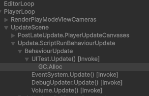
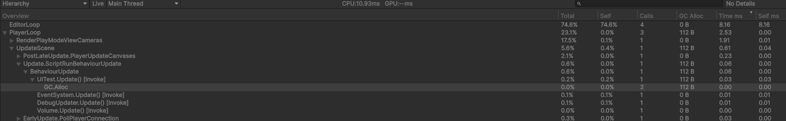
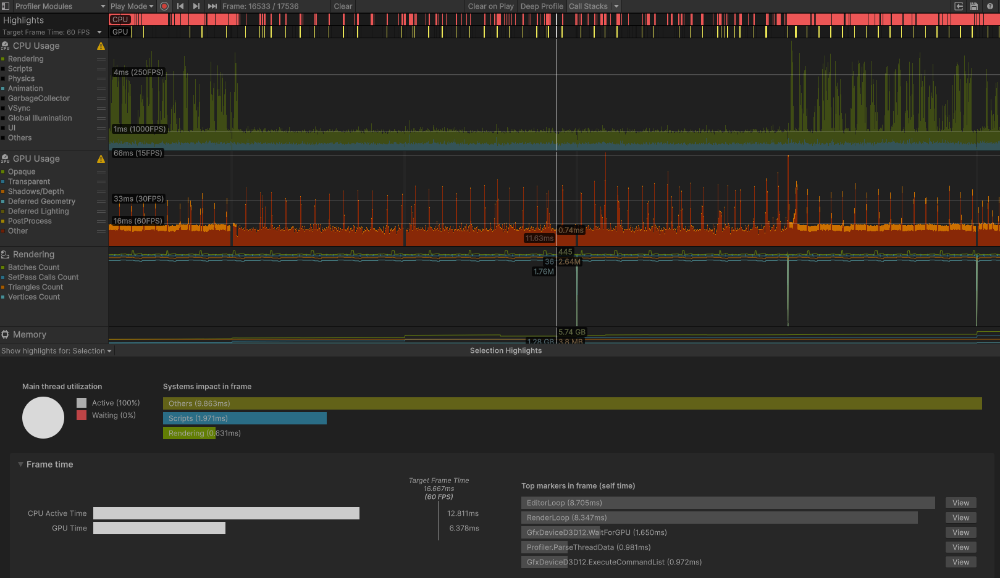

# 스키닝(Skinning)이란?


캐릭터 3D 모델(Mesh)은 수많은 정점(Vertex)으로 이루어져 있고, 내부에는 뼈대(Bone)가 들어있습니다.  

캐릭터가 걷거나 달릴 때, "뼈대가 움직임에 따라 겉면의 정점들을 어느 각도와 위치로 늘리고 꺾어야 하는지" 계산하는 과정을 스키닝(Skinning)이라고 합니다.

### CPU Skinning vs GPU Skinning vs GPU (Batched)
유니티가 스키닝을 처리하는 방식은 발전 과정에 따라 크게 3가지로 나뉩니다
```
CPU Skinning (기본 방식)
동작: 매 프레임 CPU가 캐릭터의 모든 정점 위치를 일일이 계산한 뒤, 완성된 메쉬 데이터를 GPU로 보냅니다.

장점: 개발 및 디버깅이 단순합니다.

단점: 캐릭터 수가 늘어나면 CPU가 정점 연산하느라 비명을 지르며 프레임이 떡락합니다.
```
```
GPU Skinning
동작: CPU는 캐릭터의 뼈대(Bone) 위치 값만 GPU로 넘기고, 실제 정점들을 꺾고 변형하는 무거운 수식 계산은 GPU가 직접 수행합니다.

장점: 병렬 연산에 특화된 GPU를 쓰므로 CPU의 부담이 획기적으로 줄어듭니다.

단점: 캐릭터 개별 SkinnedMeshRenderer마다 CPU가 GPU로 명령(Draw Call)을 개별 전달해야 해서 전달 오버헤드가 남습니다.
```
```
GPU (Batched) Skinning (최신 URP / DOTS 방식)
동작: CPU가 뼈대 연산 루프(CalcMatrices)조차 일일이 개별 호출하지 않고, 여러 캐릭터의 뼈대 포즈 데이터를 GPU 버퍼(Pose Buffer) 구조체로 한 번에 패킹(Batching)해서 넘깁니다.

장점: CPU 스레드가 스키닝과 관련된 일에서 완전히 해방되며, 메인 스레드 프레임 타임(ms)이 대폭 단축됩니다.
```
### GPU Skinning의 주요 특징 & 장단점
👍 장점
CPU 병목 해결: 메인 스레드의 CPU 사용량을 극단적으로 낮춰 60 FPS 방어가 쉬워집니다.

대규모 캐릭터 배치 가능: 50명, 100명 이상의 몬스터나 NPC가 동시에 등장하는 게임에서 필수적입니다.

GC Alloc (가비지 컬렉션) 0B: 메모리 할당 없이 스레드 연산만 전환하므로 프레임 드랍(Stuttering)이 없습니다.

👎주의할 점 (Trade-offs)
VRAM (GPU 메모리) 사용: GPU 상에서 포즈 버퍼와 인스턴스 데이터를 상시 들고 있어야 하므로 그래픽 메모리를 소폭 더 씁니다.

셰이더 및 파이프라인 호환성: Custom Shader를 사용할 경우 Instancing 및 GPU Skinning 패스가 지원되도록 작성되어야 합니다.

한 줄 요약
"GPU Skinning은 CPU가 낑낑대며 하던 캐릭터 정점 꺾기 연산을 병렬 처리 전문가인 GPU에게 몽땅 넘겨서, 게임의 프레임 속도(CPU ms)를 극적으로 올려주는 기술입니다."




GPU Skinning : CPU
  

GPU Skinning : GPU(Batched)
